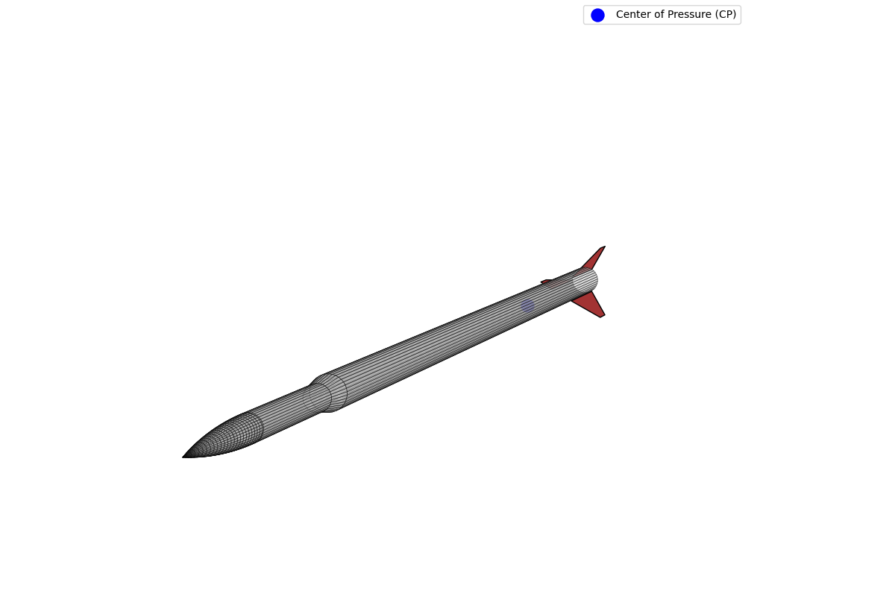

# API Reference: CalculateCOP

The `CalculateCOP` class implements the Barrowman equations to calculate the Center of Pressure (COP) for a subsonic rocket. It accounts for contributions from the nose cone, transition (if present), and fins.

All length-based units must be consistent (e.g., all in inches or all in centimeters).

For a diagram and detailed explanation of each variable, see the [Barrowman Equations page](https://www.rocketmime.com/rockets/Barrowman.html).

See `example.py` for a complete usage example.

---

## `CalculateCOP` Class

**Module:** `calculator`

### Initialization

Create an instance by providing your rocket's geometric parameters:

```python
from calculator import CalculateCOP

params = {
    'nose_type': 'ogive',
    'Ln': 12.5,
    'd': 5.54,
    'dF': 5.54,
    'dR': 5.54,
    'Lt': 0.0,
    'Xp': 0.0,
    'CR': 10.0,
    'CT': 0.0,
    'S': 5.25,
    'LF': 6.5,
    'R': 2.77,
    'XR': 9.0,
    'XB': 27.0,
    'N': 3,
}
cop = CalculateCOP(**params)
```

### Parameters

| Parameter | Type   | Description |
|-----------|--------|-------------|
| nose_type | str    | Nose cone shape: `'ogive'` or `'cone'` |
| Ln        | float  | Length of nose cone |
| d         | float  | Diameter at base of nose cone |
| dF        | float  | Diameter at front of transition (set equal to `d` if no transition) |
| dR        | float  | Diameter at rear of transition (set equal to `d` if no transition) |
| Lt        | float  | Length of transition (set to 0.0 if no transition) |
| Xp        | float  | Distance from nose tip to front of transition (set to 0.0 if no transition) |
| CR        | float  | Fin root chord |
| CT        | float  | Fin tip chord |
| S         | float  | Fin semispan (height of one fin) |
| LF        | float  | Length of fin mid-chord line |
| R         | float  | Radius of body at aft end |
| XR        | float  | Fin sweep distance (root leading edge to tip leading edge, parallel to body) |
| XB        | float  | Distance from nose tip to fin root chord leading edge |
| N         | int    | Number of fins |

For a diagram and detailed explanation of each variable, see the [Barrowman Equations page](https://www.rocketmime.com/rockets/Barrowman.html).

---

### Methods

#### `net_COP()`

Calculates the overall Center of Pressure (COP) for the entire rocket by combining all component contributions. Returns the distance from the tip of the nose cone.

```python
cop_location = cop.net_COP()
print(f"The net Center of Pressure is {cop_location:.2f} units from the nose tip.")
```

**Returns:**
- `float`: The final Center of Pressure location.

#### `visualize_rocket(show_plot=True, save_path=None)`

Generates an interactive 3D visualization of the rocket with the calculated Center of Pressure location.

```python
# Display interactive 3D plot
cop.visualize_rocket()

# Save plot to file
cop.visualize_rocket(save_path="rocket.png")

# Generate plot without displaying
fig = cop.visualize_rocket(show_plot=False)
```

**Parameters:**
- `show_plot` (bool): Whether to display the plot (default: True)
- `save_path` (str): Path to save the plot image (optional)

**Returns:**
- `matplotlib.figure.Figure`: The generated figure object

**Visualization Features:**
- Complete 3D rocket body (nose cone, transition, body tube)
- 3D fin geometry with proper positioning
- Center of Pressure marked as blue dot
- Interactive controls (rotate, zoom, pan)

**Visualization Screenshot:**
<!-- TODO: Add screenshot of 3D rocket visualization here -->


#### `nose_contribution()`
Calculates the location of the center of pressure for the nose cone alone.
- **Returns:** `float`

#### `transition_contribution()`
Calculates the location of the center of pressure for the transition section. If no valid transition exists, returns 0.
- **Returns:** `float`

#### `fin_contribution()`
Calculates the location of the center of pressure for the fin set alone.
- **Returns:** `float`

#### `constant_calculations()`
Calculates the normal force coefficient derivatives (C<sub>N</sub>) for the nose, transition, and fins.
- **Returns:** `tuple` of three floats: (cnn, cnt, cnf)

---

## References

- Barrowman Equations and variable definitions:  
  [https://www.rocketmime.com/rockets/Barrowman.html](https://www.rocketmime.com/rockets/Barrowman.html)  
  This page includes a helpful diagram and detailed explanation of each parameter used in the Barrowman equations.
